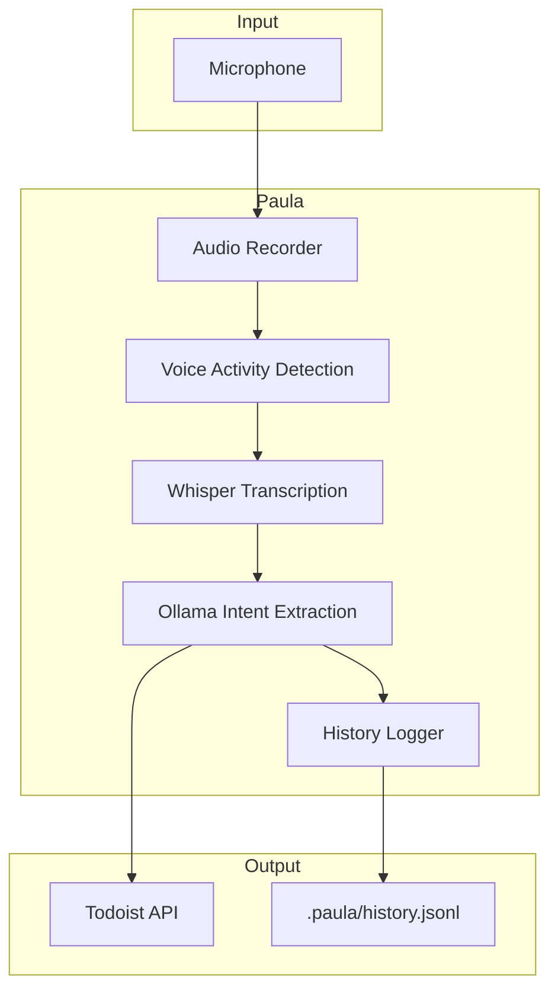
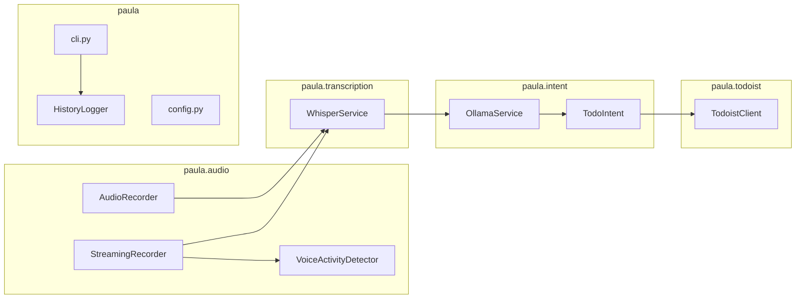
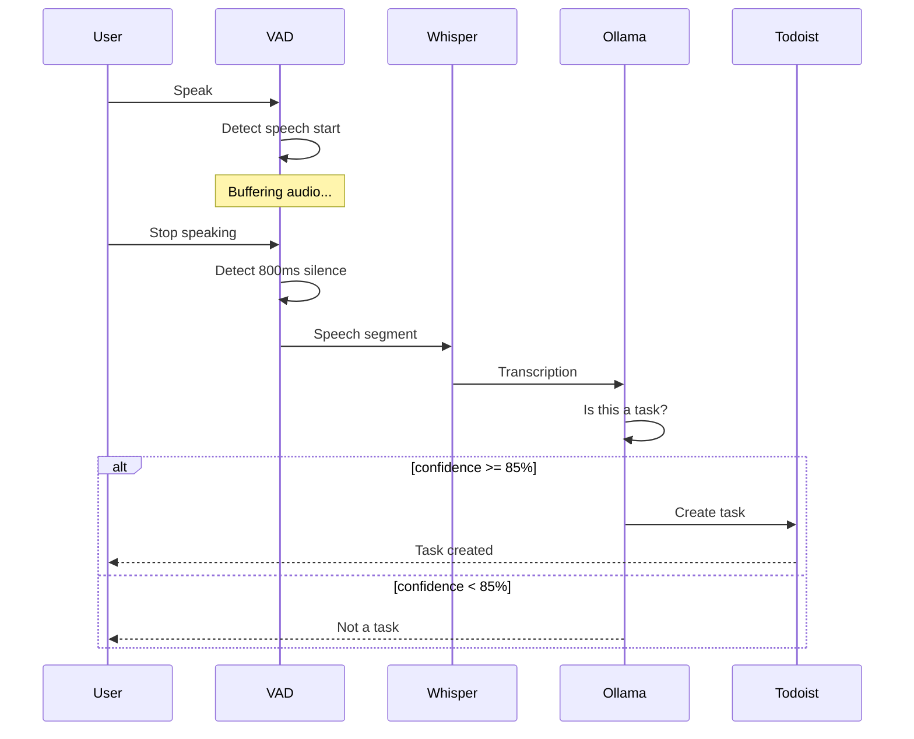

# Paula

A privacy-focused voice-to-todo application that uses local AI models to transcribe speech and create tasks in Todoist.

## Overview

Paula lets you create Todoist tasks by simply speaking. It uses:
- **Local Whisper** for speech-to-text transcription (no cloud API required)
- **Local Ollama** for intelligent intent extraction (understands priorities, due dates, projects, etc.)
- **Todoist API** for creating tasks

Everything runs locally on your machine except the final Todoist API call, keeping your voice data private.

## Features

- **Two operation modes**: Manual recording (`run`) and continuous hands-free mode (`stream`)
- Real-time voice activity detection (VAD) for automatic speech boundary detection
- Local speech transcription with Whisper
- Intelligent task detection with confidence scoring
- Comprehensive intent extraction (title, description, priority, due date/time, project, section, labels, duration, recurring patterns)
- **Smart scheduling**: Handles recurring tasks ("every Monday"), specific dates and times ("Tuesday at 3pm"), and date-only tasks ("by Friday")
- Automatic task creation when confidence exceeds threshold
- History logging of all transcriptions and intents
- Beautiful terminal UI with live updates

---

## Architecture

### High-Level Data Flow



### Module Structure



### Stream Mode Sequence



---

## Modules

### `paula.audio`

**AudioRecorder** - Manual recording with start/stop control
- Records audio from microphone using `sounddevice`
- Saves to temporary WAV file for transcription
- Supports playback of recorded audio

**StreamingRecorder** - Continuous recording with VAD
- Yields speech segments as they are detected
- Integrates with `VoiceActivityDetector`
- Generator-based API for easy consumption

**VoiceActivityDetector** - Speech boundary detection
- Uses WebRTC VAD for real-time speech detection
- Configurable aggressiveness (0-3)
- Detects speech start/end with configurable thresholds
- Buffers speech segments with pre/post padding

### `paula.transcription`

**WhisperService** - Local speech-to-text
- Uses `faster-whisper` (CTranslate2-optimized Whisper)
- Lazy model loading (loads on first use)
- Supports both file-based and in-memory transcription
- Configurable model size (tiny, base, small, medium, large)

### `paula.intent`

**OllamaService** - LLM-based intent extraction
- Connects to local Ollama server
- Extracts structured `TodoIntent` from transcription
- Returns JSON with task detection and all metadata

**TodoIntent** - Structured task data model
```
- is_task: bool          # Is this an actionable task?
- confidence: float      # 0.0-1.0 confidence score
- title: str             # Task title
- description: str       # Additional details
- priority: int          # 1 (urgent) to 4 (normal)
- project_name: str      # Target project
- section_name: str      # Section within project
- labels: list[str]      # Task labels
- due_date: str          # YYYY-MM-DD format
- due_time: str          # HH:MM format (combined with due_date for specific times)
- due_string: str        # Natural language ("every Monday", "tomorrow")
- duration: int          # Time estimate
- duration_unit: str     # minute/hour/day (hour converted to minutes)
- parent_task_name: str  # For subtasks
- is_subtask: bool       # Subtask flag
- notes: str             # Additional context
```

### `paula.todoist`

**TodoistClient** - Todoist API integration
- Creates tasks with full metadata support
- Caches projects and sections for name-to-ID lookup
- Finds parent tasks by name for subtask creation
- Supports all Todoist task features

### `paula.history`

**HistoryLogger** - Transcription history
- Logs all transcriptions with their intent analysis
- JSONL format (one JSON object per line)
- Stored in `.paula/history.jsonl` (git ignored)
- Useful for debugging and reviewing past sessions

### `paula.config`

**Settings** - Configuration management
- Loads from `.env` file using Pydantic Settings
- Configurable: Whisper model, Ollama model, VAD parameters, confidence thresholds

---

## Commands

### `paula run` - Manual Mode

Interactive voice-to-todo with manual recording control.

```bash
uv run paula run
```

1. Press Enter to start recording
2. Speak your task
3. Press Enter to stop recording
4. Paula transcribes, extracts intent, and creates task
5. Repeat or Ctrl+C to exit

### `paula stream` - Continuous Mode

Hands-free continuous recording with automatic task creation.

```bash
uv run paula stream
```

Options:
- `--confidence, -c FLOAT` - Minimum confidence for auto-create (default: 0.85)
- `--vad-level, -v INT` - VAD aggressiveness 0-3 (default: 2)
- `--dry-run` - Show what would be created without creating tasks

Examples:
```bash
# Default continuous mode
uv run paula stream

# Higher confidence threshold
uv run paula stream --confidence 0.9

# More aggressive VAD (filters more noise)
uv run paula stream --vad-level 3

# Test without creating tasks
uv run paula stream --dry-run
```

### `paula setup` - Configuration Wizard

Interactive setup for configuring Paula.

```bash
uv run paula setup
```

Configures:
- Todoist API token
- Whisper model
- Ollama model

### `paula test` - Health Checks

Run health checks on all services.

```bash
uv run paula test
```

Checks:
- Microphone availability
- Ollama server status
- Ollama model availability
- Todoist API connection

---

## Scheduling Examples

Paula intelligently handles different types of scheduling:

### Recurring Tasks
Use natural language for repeating patterns:
```
"remind me to take vitamins every morning"
"water the plants every Monday"
"weekly team meeting on Fridays"
```

### Specific Date and Time
Mention the day and time for precise scheduling:
```
"dentist appointment Tuesday at 3pm"
"call mom tomorrow at 5:30pm"
"meeting on December 31st at 9am"
```

### Date Only
For tasks without specific times:
```
"finish report by Friday"
"submit invoice by next Monday"
"birthday party on Saturday"
```

### Duration Estimates
Specify how long tasks will take:
```
"meeting for 2 hours"
"workout for 30 minutes"
"review document for 45 minutes"
```

**Note**: Paula automatically handles timezone conversion using your system timezone when creating tasks with specific times.

---

## Configuration

Paula uses a `.env` file for configuration. Create one with `paula setup` or manually:

```bash
# Required
TODOIST_API_TOKEN=your_token_here

# Whisper (speech-to-text)
WHISPER_MODEL=base          # tiny, base, small, medium, large
WHISPER_DEVICE=cpu          # cpu or cuda
WHISPER_LANGUAGE=en

# Ollama (intent extraction)
OLLAMA_MODEL=llama3.2:3b
OLLAMA_BASE_URL=http://localhost:11434
OLLAMA_TIMEOUT=30

# Audio
SAMPLE_RATE=16000
MAX_RECORDING_DURATION=60

# Streaming mode (VAD)
VAD_AGGRESSIVENESS=2        # 0-3, higher = more aggressive
SILENCE_THRESHOLD_MS=800    # Silence duration to trigger transcription
MIN_SPEECH_MS=250           # Minimum speech duration
AUTO_CREATE_CONFIDENCE=0.85 # Confidence threshold for auto-create

# Logging
LOG_LEVEL=INFO
```

---

## Prerequisites

### 1. uv - Python Package Manager

```bash
# macOS/Linux
curl -LsSf https://astral.sh/uv/install.sh | sh
```

### 2. Ollama - Local LLM Server

```bash
# macOS
brew install ollama

# Start Ollama service
ollama serve

# Pull the recommended model
ollama pull llama3.2:3b
```

### 3. Todoist API Token

Get your API token from https://todoist.com/prefs/integrations

---

## Installation

```bash
# Clone or navigate to the project
cd paula

# Sync dependencies
uv sync

# Run setup wizard
uv run paula setup

# Verify installation
uv run paula test
```

---

## History File

Paula logs all transcriptions and their intent analysis to `.paula/history.jsonl`:

```json
{
  "timestamp": "2025-12-17T14:30:45.123456",
  "transcription": "buy milk tomorrow",
  "intent": {
    "is_task": true,
    "confidence": 0.95,
    "title": "Buy milk",
    "priority": 4,
    "due_date": "2025-12-18"
  },
  "task_created": true,
  "task_id": "8675309",
  "command": "stream"
}
```

This file is git-ignored and useful for:
- Debugging intent extraction issues
- Reviewing what was said vs. what was understood
- Analyzing task creation patterns

---

## Troubleshooting

### "Ollama connection failed"
- Make sure Ollama is running: `ollama serve`
- Check that the model is pulled: `ollama pull llama3.2:3b`

### "Microphone access denied"
- On macOS, go to System Settings > Privacy & Security > Microphone
- Grant permission to your terminal application

### "Invalid Todoist token"
- Get a fresh token from https://todoist.com/prefs/integrations
- Run `uv run paula setup` to reconfigure

### Slow transcription
- The first run downloads the Whisper model (may take a few minutes)
- Use a smaller model: `WHISPER_MODEL=tiny`
- Or upgrade for better accuracy: `WHISPER_MODEL=small`

### VAD too sensitive / not sensitive enough
- Adjust VAD aggressiveness: `uv run paula stream --vad-level 1` (less aggressive)
- Or increase: `uv run paula stream --vad-level 3` (more aggressive)

### Tasks not being created automatically
- Check confidence threshold: `uv run paula stream --confidence 0.7`
- Use `--dry-run` to see what's being detected
- Review `.paula/history.jsonl` for intent analysis

---

## Project Structure

```
paula/
├── src/paula/
│   ├── __init__.py
│   ├── cli.py              # CLI commands (run, stream, setup, test)
│   ├── config.py           # Configuration management
│   ├── history.py          # History logging
│   ├── audio/
│   │   ├── __init__.py
│   │   ├── recorder.py     # AudioRecorder, StreamingRecorder
│   │   └── vad.py          # VoiceActivityDetector
│   ├── transcription/
│   │   ├── __init__.py
│   │   └── whisper_service.py
│   ├── intent/
│   │   ├── __init__.py
│   │   ├── ollama_service.py  # OllamaService, TodoIntent
│   │   └── prompts.py
│   ├── todoist/
│   │   ├── __init__.py
│   │   └── client.py
│   └── utils/
│       ├── __init__.py
│       ├── exceptions.py
│       └── logging.py
├── plans/                  # Implementation plans
├── pyproject.toml
├── .env                    # Configuration (git ignored)
├── .paula/                 # History (git ignored)
└── README.md
```

---

## License

MIT
